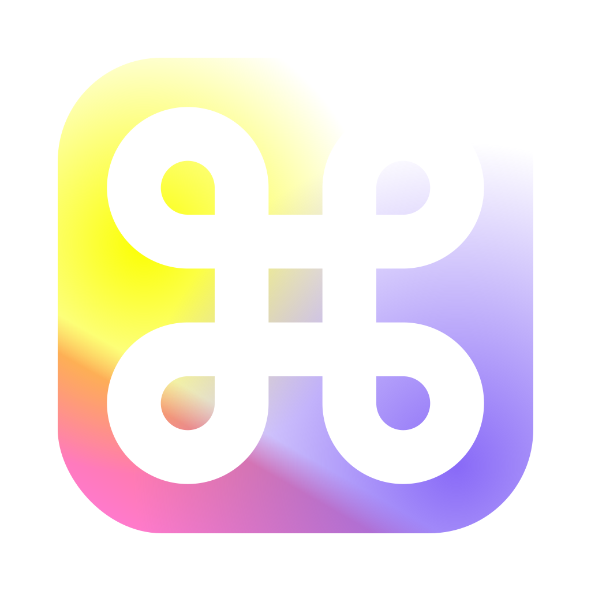
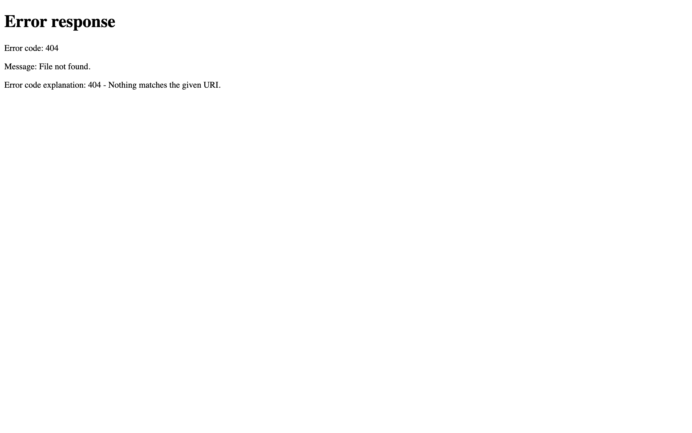

<div align="center">
  
  <h1>⌨️ Shortcut Viewer</h1>
  <p><strong>A beautifully packaged, native-like macOS application that visualizes over 5,000 shortcuts across all your tools.</strong></p>
  
  [](https://www.gnu.org/licenses/gpl-3.0)
  [](https://apple.com/macos)
  [](https://developers.google.com/web/progressive-web-apps/)
</div>

<br/>

## ✨ Why Shortcut Viewer?

Most shortcut cheat sheets are static PDFs. **Shortcut Viewer** is different. It is a highly optimized, fully interactive application that lives on your Mac. It auto-scans your system to dynamically generate up-to-date keyboard shortcuts tailored exactly to the apps you have installed.

Whether you're using VS Code, Obsidian, After Effects, or even custom BetterTouchTool (BTT) gestures—Shortcut Viewer maps them all beautifully onto a visual keyboard layout.



---

## 🚀 Key Features

* **🎨 Stunning Visual Keyboard**: An interactive, Retina-ready keyboard UI that highlights your shortcuts exactly as they appear on your physical keyboard.
* **⚡ Native App Experience**: Packaged as a proper macOS `.app` using Chrome's Window Controls Overlay (WCO). No clunky browser tabs, no web address bars. Just a sleek, native window.
* **🔍 5,000+ Shortcuts Recognized**: 
  * Auto-extracts from Win32 apps (`axmenudump`).
  * Deep integrations with VS Code, Obsidian, Chrome, BetterTouchTool, and Karabiner.
* **🧩 Smart Filtering Contexts**: Switch seamlessly between 'Global' hotkeys and app-specific contexts via a beautiful dropdown UI.
* **🛠 One-Click Installer**: We bundle everything into a simple `Shortcut-Viewer.dmg`. Just drag and drop into your Applications folder!


---

## 📦 Installation

Installing Shortcut Viewer is as easy as installing any native Mac app.

1. **Download the DMG**: Head over to the [Releases](https://github.com/kim-dongryeong/shortcut-viewer/releases) page and download `Shortcut-Viewer.dmg`.
2. **Mount & Drag**: Open the DMG and drag `Shortcut Viewer.app` to your `Applications` folder.
3. **Launch**: Open Shortcut Viewer from Launchpad or Spotlight. (It runs entirely locally via a lightweight PWA shell!)

> **Note**: As an open-source app, macOS might prompt you about downloading from the internet. Simply `Right Click > Open` the first time to bypass Gatekeeper.


---

## 🛠 For Developers & Tinkerers

Want to build from source or contribute?

```bash
# 1. Clone the repository
git clone https://github.com/kim-dongryeong/shortcut-viewer.git
cd shortcut-viewer

# 2. Render the latest shortcuts
python3 render.py

# 3. Build the macOS App & DMG
./scripts/make-macos-app.sh --dmg
```

Your freshly built `.dmg` will be waiting for you in the `dist/` folder!

---

## 📜 License

This project is fully open-source and proudly distributed under the **[GNU General Public License v3.0 (GPLv3)](LICENSE)**. Feel free to use, modify, and distribute it, provided you keep it open and free!

---
<div align="center">
  <i>Crafted with ❤️ by Kim Dongryeong</i>
</div>
