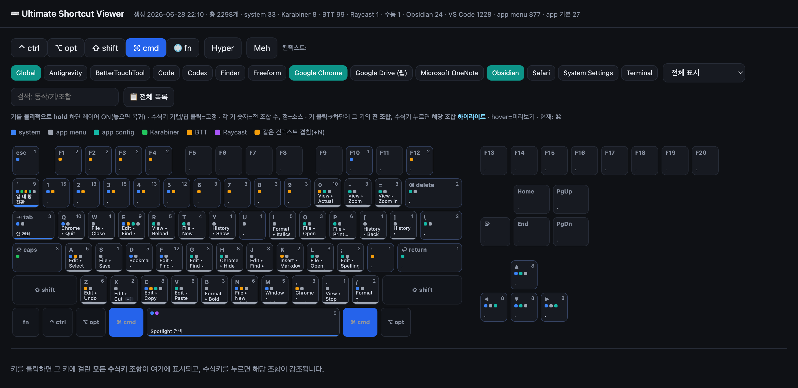

# Shortcut Viewer

**A unified keyboard-shortcut viewer for macOS.** See every shortcut from *every* source — macOS
system shortcuts, each app's menu bar, app keymaps (VS Code, Obsidian), Karabiner-Elements,
BetterTouchTool (per preset), Raycast — laid out on one interactive **keyboard grid**. Pick a
modifier layer (or just hold the keys) and every key lights up with what it's bound to, color-coded
by source. Find conflicts, and find the **free** combos.



## Why

Every other tool shows you a slice:

- **Cheat-sheet viewers** (CheatSheet, KeyCue, KeyClu, KeyMinder) show only the **current app's menu** shortcuts.
- **Conflict detectors** (HotkeyClash) scan system + Karabiner + running apps, but miss BTT / Raycast / IDE keymaps and aren't a keyboard grid.
- **Learning tools** (KeyCombiner) use manual collections, not your live config.

Shortcut Viewer is the only one that **aggregates your whole machine, across all sources, onto one
keyboard grid** — with conflict + free-combo finding, per-app context filtering, and BTT-preset depth.

## Sources it reads

| Source | How |
|---|---|
| macOS system | `com.apple.symbolichotkeys` + curated defaults (Spotlight, screenshots, Mission Control, ⌃⌘D lookup, fn/Globe…) |
| App menus | Accessibility API menu-bar scan of every running app |
| VS Code | `keybindings.json` + exported default keymap (incl. `when` clauses) |
| Obsidian | per-vault `.obsidian/hotkeys.json` |
| Karabiner-Elements | `~/.config/karabiner/karabiner.json` |
| BetterTouchTool | its Core Data SQLite store directly — no socket server (incl. preset + app scope + action name) |
| Raycast | `raycast_manual.json` (its DB is encrypted) |
| Manual globals | `manual_globals.json` (app-registered global hotkeys, e.g. Google Drive) |

## Requirements

- macOS (built/tested on Apple Silicon, macOS 14+)
- Xcode command-line tools (`swift`), Python 3, `jq`
- Any browser to open `viewer.html`

## Quick start

```sh
./refresh.sh        # scan every source → shortcuts.json → viewer.html
open viewer.html
```

- `refresh.sh` re-scans everything (needs Accessibility for app menus).
- `render.py` only re-renders the viewer from existing `shortcuts.json` (no re-scan) — for UI tweaks.

### One-time setup for full coverage

1. **App menus** — grant your terminal **Accessibility** (System Settings ▸ Privacy & Security ▸ Accessibility), then run `./refresh.sh` from it.
2. **VS Code** — run `./dump_vscode.sh` once (drives VS Code to export its default keybindings), or in VS Code: ⇧⌘P → *Open Default Keyboard Shortcuts (JSON)* → save as `vscode_default_keybindings.json`.
3. **Raycast / global app hotkeys** — `cp raycast_manual.example.json raycast_manual.json` and `cp manual_globals.example.json manual_globals.json`, then edit.

## Using the viewer

- Toggle modifier chips (⌃⌥⇧⌘ / Hyper / Meh / 🌐fn) **or physically hold** the keys → the grid switches layer live.
- Each key shows a count + source-colored dots even on the base layer (which keys are "busy").
- Click a key (or press it) → see **all 16 modifier combos** for it, taken *and* free.
- Context chips filter by app (multi-select), plus `BTT (all)` and per-preset.
- 📋 list view, search by action/key/combo, and a "free combos only" filter.
- **⚠️ Conflicts · ✨ Free combos · 📊 Stats · 🎓 Quiz · 🖨 Print/PDF · ⤓ CSV/MD · ☾ theme · URL deep-links · ＋ My Shortcuts** — competitor-parity views (KeyCue/KeyClu/CheatSheet/KeyCombiner).

## Set global hotkeys (SV Hotkeys) 🌐

Shortcut Viewer doesn't just *show* shortcuts — it can **set real global hotkeys**. Because it already
knows every shortcut from every source, it uniquely lets you **find a conflict-free combo and bind it in one place**
(open an app, run a command, paste text — from anywhere). The viewer's **🌐 글로벌 핫키** tab builds a `hotkeys.json`;
run it with any of four backends:

```sh
./install_hotkeys.sh          # ① native menu-bar daemon (no Accessibility for ⌘/⌥/⌃) — easiest
python3 gen_hotkeys.py        # ②③④ export for Karabiner / skhd / Hammerspoon (if you already run one)
```

Full guide + 15+ ready-to-use scenarios: **[HOTKEYS.md](HOTKEYS.md)**. Hotkey mechanism adapted from `~/dev/maverything` (Carbon `RegisterEventHotKey` + `CGEventTap`).

## How it works

```
collectors (build.py + axmenudump.swift)  →  shortcuts.json  →  viewer.html
                                                              (viewer.template.html)
```

- **`build.py`** — collects + normalizes every source into one canonical schema, then renders the viewer.
- **`axmenudump.swift`** — reads running apps' menu shortcuts via the Accessibility API (`swiftc axmenudump.swift -o axmenudump`; `refresh.sh` builds it for you).
- **`viewer.template.html`** — the interactive keyboard-grid UI; data is injected at the `/*__DATA__*/` marker.

## Limitations (honest)

- **No tool can enumerate every global hotkey** on macOS — third-party apps' `RegisterEventHotKey` registrations aren't exposed by any public API. We read every source we *can*; the rest go in the manual files.
- **Raycast** encrypts its local DB → manual entry only.
- **App menus** are read only for *running* apps (an Accessibility limitation).
- **BTT action labels** — the base action name is read from the DB; full parameter labels (window coordinates, etc.) live in binary-plist blobs and aren't fully reconstructed.
- The macOS NSEvent *Function* flag is set intrinsically on F-keys/arrows/nav keys; those are shown without `fn` (only real 🌐+letter combos keep `fn`).

## License

MIT © 2026 KDR
